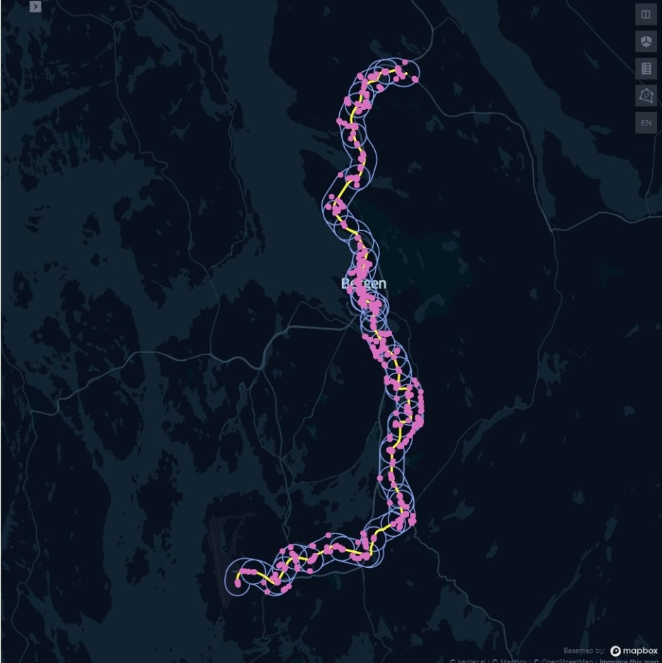

# Mobility Corridors Analysis
This report is a small description of Mobility Corridors analysis project.

## Table of Contents
1. [Overview](#overview)
1. [Data description](#data-description)
1. [Downloading data](#data-downloading)
1. [Corridors Analysis](#corridors-analysis)

## Overview
Skyss is the public authority that plans, purchases, and markets the public transport services governed by the county authority in Hordaland, Norway. Skyss offers trips by light rail (Bybanen), bus, local boat, and ferry throughout Hordaland.
As part of this analysis, we looked at the data to understand areas and corridors for the public transport routes and passengers count, in order to optimize public transport and suggest the routes in order to reduce the cost and increase the ridership.

## Data description
Various datasets are available through the [**Skyss Public API**](https://skyss-public-api-test.azurewebsites.net/index.html).
Descriptions of the variables and fields are available on the API website.
Following datasets are currently available:
1. Calender
2. Lines
3. Routes
4. Stop Points
5. Trips information (raw & aggregated)

## Data downloading
- **Period** : 2 Months (Oct & Nov 2019) - chosen as Normal Traffic Period.
- **Trips Data** is very large and granular, so created day wise csv/parquet files.
- **Stop Points** and **Lines** data.

## Corridors Analysis
- Defined geometry and visualized geodata, for example, Bybanen corridors for a line and stops within a certain radius with average onboard passengers at each segment.

- Read and wrote geodata on Postgres.
- Defined shapefiles and read shapefiles in Kepler map to get a map view of geometry data for line's corridors, for example:

- Analysed and visualized average and total passengers counts for each segment of the Bybanen line.
- Defined period by dividing a day into different parts and calculated average onboard for the line in a different part of the day and plotted period data.
- Filtered data for weekdays and again calculated average passengers counts of weekdays data for the line and plotted this data.